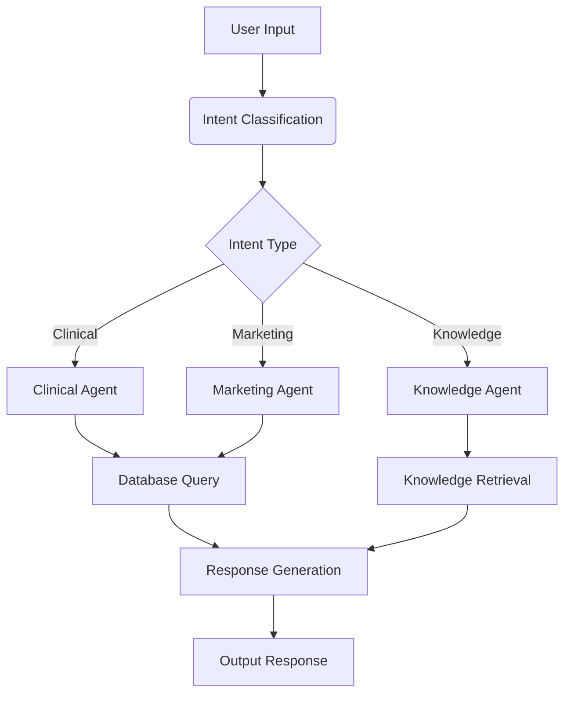

# COB Company Chatbot System

## Overview
The COB Company Chatbot System is an advanced AI-powered customer service solution designed to handle appointment scheduling and product inquiries for two distinct business units: a medical clinic and a tech product company. This system demonstrates sophisticated natural language understanding, multi-intent classification, and seamless integration with backend databases.

## Key Features
- **Dual-domain support**: Handles both clinical appointments and tech product inquiries
- **Intelligent routing**: Classifies user intents and routes to specialized agents
- **Database integration**: Works with SQLite databases for appointments and customer data
- **Knowledge retrieval**: Answers questions using a Retrieval-Augmented Generation (RAG) system
- **Session management**: Maintains conversation context across interactions
- **Human escalation**: Detects frustration and transfers to human agents when needed

## Technology Stack
- **Language Models**: Google Gemini 2.5 Flash
- **Frameworks**: LangChain, LangChain Google GenerativeAI
- **Vector Database**: FAISS
- **Data Storage**: SQLite
- **Environment Management**: python-dotenv
- **Data Generation**: Faker, Pandas

## Project Structure
```plaintext
project_root/
├── data_generation/          # Scripts for generating sample databases
│   ├── clinic_data.py        # Generates clinic appointment data
│   ├── cob_data.py           # Generates COB product and customer data
│   └── generate_databases.py # Main script to create SQLite databases
├── database_inspection/      # Utilities for examining database content
│   └── inspect_databases.py  # Displays database schema and sample data
├── chatbot/                  # Core chatbot implementation
│   ├── agents/               # Specialized agents for different domains
│   │   ├── clinical_agent.py # Handles medical appointment requests
│   │   ├── knowledge_agent.py# Answers product and policy questions
│   │   └── marketing_agent.py# Manages marketing meeting scheduling
│   ├── tools/                # Tools for database operations
│   │   ├── clinic_tools.py   # Clinic appointment tools
│   │   ├── knowledge_tools.py# Knowledge retrieval tools
│   │   └── marketing_tools.py# Marketing meeting tools
│   ├── database/             # Database management
│   │   └── manager.py        # Database connection and query handling
│   ├── knowledge_base/       # Knowledge management
│   │   └── manager.py        # RAG system implementation
│   ├── models/               # Data models
│   │   └── appointments.py   # Appointment request data structures
│   ├── main_agent.py         # Main orchestrator agent
│   └── chatbot_system.py     # Chatbot system implementation
├── knowledge_base/           # Text knowledge files
│   ├── policies.txt          # Company policies and procedures
│   └── products.txt          # Product information and specifications
├── .env.example              # Environment variable template
└── run_demo.py               # Main entry point for the chatbot
```

## How It Works
The chatbot system follows a sophisticated workflow:

1. **User Input**: Receives natural language queries from users
2. **Intent Classification**: Determines if the request is for clinical, marketing, or general information
3. **Agent Routing**: Directs the request to the appropriate specialized agent
4. **Data Processing**: 
   - Extracts parameters (dates, times, specialties, etc.)
   - Queries databases for availability
   - Retrieves relevant knowledge
5. **Response Generation**: Formulates natural language responses
6. **Session Management**: Maintains context for multi-turn conversations


## Demo


https://github.com/user-attachments/assets/baee2452-fd46-49b5-b07d-7dae9314b796


## Getting Started

### Prerequisites
- Python 3.9+
- Google Gemini API key
- Required packages: `pip install -r requirements.txt`

### Installation
1. Clone the repository:
```bash
git clone https://github.com/MahmoudSaad21/COB_Company_Chatbot-.git
cd COB_Company_Chatbot-
```

2. Install dependencies:
```bash
pip install -r requirements.txt
```

3. Set up environment:
Edit `.env` and add your Google API key:
```env
GOOGLE_API_KEY=your_api_key_here
```

### Generating Sample Data
```bash
python data_generation/generate_databases.py
```
This creates two SQLite databases:
- `clinic_appointments_2.db` - Clinic appointment data
- `cob_system_2.db` - COB product and customer data

### Running the Chatbot
```bash
python run_demo.py
```

### Example Interaction
```
COB Customer Care AI System
==================================================
Type 'exit' to quit or 'reset' to start new session

You: I need to book a doctor appointment for tomorrow afternoon

Bot: What specialty are you looking for? We have Cardiology, Dermatology, 
Pediatrics, Orthopedics, Neurology, Oncology, General Practice, ENT, and Ophthalmology.

You: Cardiology please

Bot: Here are available cardiology appointments for tomorrow:
- Dr. Smith at 2:00 PM at Downtown Clinic
- Dr. Johnson at 3:30 PM at Westside Medical
Which would you prefer?
```

## Key Components

### Agents
- **Clinical Agent**: Handles medical appointment scheduling
- **Marketing Agent**: Manages product demo meetings
- **Knowledge Agent**: Answers questions about products and policies

### Tools
- **Database Tools**: Query and update SQLite databases
- **Knowledge Tools**: Retrieve information from text knowledge base
- **Booking Tools**: Create appointments in both systems

### Databases
1. **Clinic Database**:
   - Doctor schedules
   - Appointment availability
   - Patient information

2. **COB Database**:
   - Product catalog
   - Customer information
   - Marketing team availability

## Customization
You can customize the system by:
1. Modifying knowledge files in `knowledge_base/`
2. Adjusting database schemas in `data_generation/`
3. Updating agent logic in `chatbot/agents/`
4. Changing conversation flows in `main_agent.py`

## Future Enhancements
- [ ] Web interface integration
- [ ] Calendar synchronization
- [ ] SMS/Email notifications
- [ ] Multi-language support
- [ ] Sentiment analysis for improved interactions

## Contributing
Contributions are welcome! Please follow these steps:
1. Fork the repository
2. Create your feature branch (`git checkout -b feature/your-feature`)
3. Commit your changes (`git commit -am 'Add some feature'`)
4. Push to the branch (`git push origin feature/your-feature`)
5. Open a pull request

## License
This project is licensed under the MIT License - see the [LICENSE](LICENSE) file for details.

## Acknowledgements
- Google Gemini API team
- LangChain developers
- Faker library maintainers

---
**Note**: Add actual screenshots of the chatbot in action to make the README more engaging. You can also include a demo video link once you create one.
